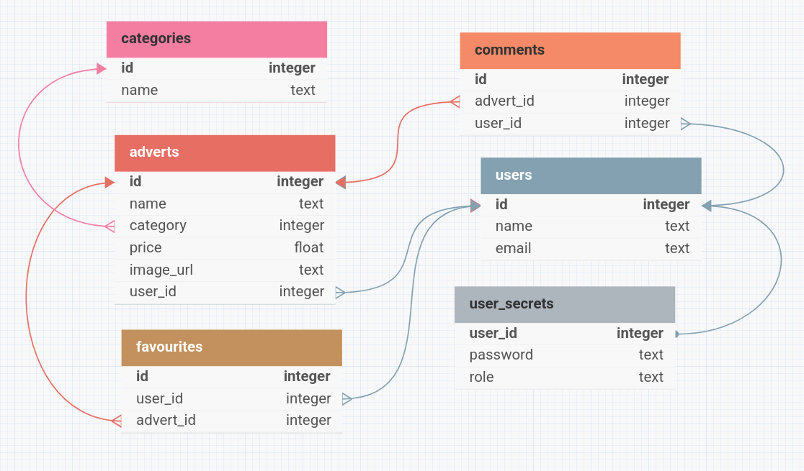

# TECHIN-Egzaminas

TECHIN study center practical exam

## Table of contents

- [Abstract](#abstract)
- [Installation](#installation)
- [Usage](#usage)
- [Database Structure](#database-structure)
- [Admin Login Data](#admin-login-data)
- [Technologies Used](#technologies-used)
- [License](#license)

## Abstract

This project is a fullstack application that enables users to create, edit, favourite and comment on different adverts, which promote users' products or services.
Users can create listings with image uploads, rate products, and leave reviews on purchased items.
Administrators have full access to user and system management features, including user moderation and role assignment.

## Installation

1. Clone the repository:

```bash
 git clone https://github.com/pavelgusev431/Pavasario-projektas.git
```

2. Install dependencies:

```bash
 npm install
```

3. Install PostgreSQL on your local machine

4. Create a local postgresql database

5. Navigate to _server -> .env_ file and change the required fields to the ones you have configured:

```
DB_NAME=your_database_name
DB_USER=your_database_user
DB_PASS=your_database_password
```

## Usage

This is a fullstack project, meaning you will have to run both the client and the server.
First, navigate to the server directory:

```bash
cd server
```

And run the following command:

```bash
npm run start
```

Then in a separate terminal navigate to the client directory:

```bash
cd client
```

And run the same command:

```bash
npm run start
```

If there are no errors - you have configured everything correctly and the web-app is working.
Now you can open [this url](http://localhost:5173) to see your started project online.

## Database Structure



## Admin Login Data

To login as an admin:

- username: admin
- password: Admin123.

Both of those are written in the [.env](./server/.env) file in the server directory and can be changed to whatever crenedtials you like.

## Technologies Used

Client:

- React (Vite)
- TailwindCSS
- axios
- nanoid
- js-sha1
- js-sha256
- js-cookie

Server:

- Node.js
- Express.js
- fs
- nodemon
- sequelize
- pg/pg-hstore
- jsonwebtoken
- nanoid
- multer
- js-sha1
- js-sha256
- cors
- dotenv
- cookie-parser

Miscelanious:

- eslint
- prettier

## License

This project is licensed under the [MIT License](LICENSE).
